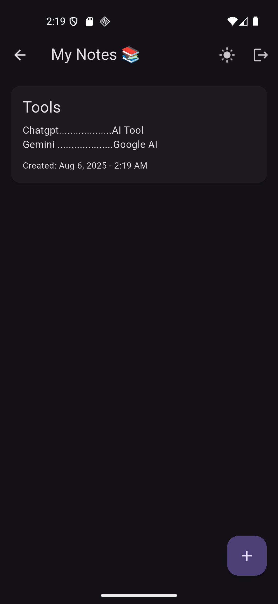
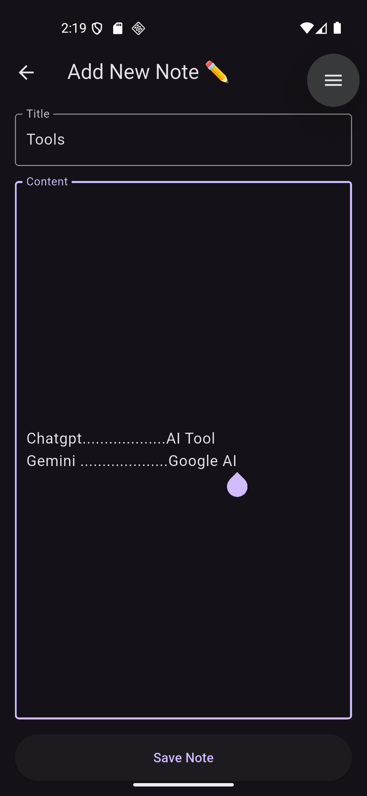
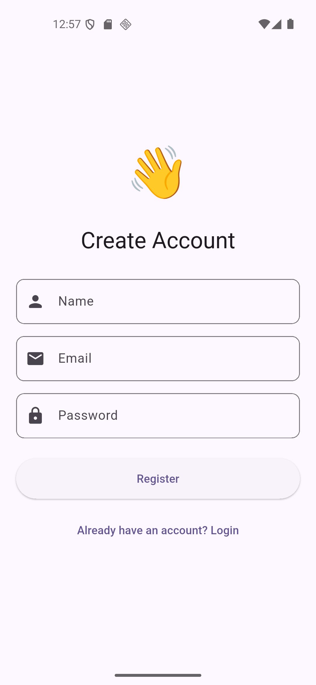
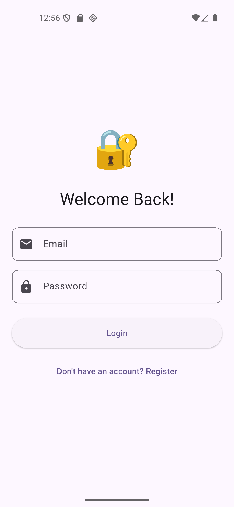

# 🗒️ My Notes App – Flutter-Based Personal Note Keeper

## 🚀 Project Overview

**My Notes App** is a sleek and intuitive note-taking app developed using **Flutter** and **Dart**. It allows users to create, view, update, and delete notes in real-time. Featuring modern UI design, secure authentication via Firebase, and efficient state management with Provider, it offers a responsive and user-friendly experience across devices.

---

## 🌟 Features

- 🔐 **User Authentication**
  - Sign in using email & password via Firebase Auth.

- 📝 **Create Notes**
  - Add notes with title and content.
  - Notes are saved in real-time using Firestore.

- 📃 **View Notes**
  - Display all saved notes in a scrollable, card-based list.

- ✏️ **Edit Notes**
  - Update existing notes with new content or title.

- 🗑️ **Delete Notes**
  - Remove notes permanently with a single tap.

- 🌐 **Realtime Sync**
  - Automatic syncing with Firestore cloud database.

- 🎨 **Modern UI**
  - Clean and minimal interface with dark/light theme support.

- 🧠 **State Management**
  - Efficient and scalable state handled by Provider.

- 🌗 Display Settings
  - Light/Dark mode toggle feature.

---

## 💻 Tech Stack

| Category         | Technology        |
|------------------|-------------------|
| Language         | Dart              |
| Framework        | Flutter           |
| Auth             | Firebase Auth     |
| Backend          | Cloud Firestore   |
| State Management | Provider          |
| IDE              | Android Studio    |
| Architecture     | MVVM              |

---

## 📸 Screenshots

| 🏠 Home Screen | ➕ Add Note Screen | 👤 Register Screen | 🔐 Login Screen |
|----------------|-------------------|---------------------|----------------|
|  |  |  |  |

---

## 📦 Getting Started

1. Clone the repository.
2. Open in *Android Studio*.
3. Run flutter pub get to fetch dependencies.
4. Launch using an emulator or connected device with flutter run.

---

## 🔮 Future Enhancements

- 🔍 Search and filter notes
- 📌 Note pinning and archiving
- 🔔 Implement notification reminders.
- ☁ Cloud backup support
- 🧠 AI-based smart notes summarization

---

## 🤝 Connect with Me

 [*M-Attaullah*](https://github.com/M-Attaullah)  
 [*Muhammad Attaullah*](https://www.linkedin.com/in/muhammad-attaullah-705764333/)

---

> 🛠️ *Note:*  This project was developed as part of an internship task to demonstrate skills in Firebase integration, Flutter UI/UX design, and scalable app architecture using Provider and MVVM.

